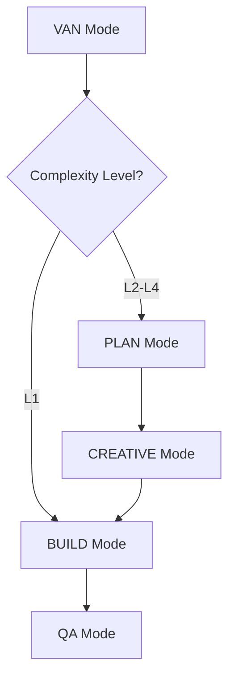

# Memory Bank Command Guide

This guide provides all the commands you can use to interact with the Memory Bank system. Each command triggers specific workflows and validations to ensure project quality and consistency.

## 🚀 Quick Start Commands

| Command | Description |
|---------|-------------|
| `VAN` | Initialize project or start VAN mode |
| `VAN QA` | Run technical validation |
| `PLAN` | Switch to planning mode |
| `CREATIVE` | Switch to creative mode |
| `BUILD` | Switch to build mode (requires QA validation) |
| `QA` | Run QA validation (available anytime) |

## 🎨 Creative Mode Commands

Use these commands when in CREATIVE mode to manage different design phases:

| Command | Purpose |
|---------|----------|
| `CREATIVE UI` | Start UI/UX design phase |
| `CREATIVE ARCH` | Start architecture design phase |
| `CREATIVE DATA` | Start data model design phase |
| `CREATIVE ALGO` | Start algorithm design phase |

## 📋 Planning Mode Commands

Different planning approaches based on task complexity:

| Command | Use Case |
|---------|----------|
| `PLAN L1` | Level 1 - Quick Bug Fix planning |
| `PLAN L2` | Level 2 - Enhancement planning |
| `PLAN L3` | Level 3 - Feature planning |
| `PLAN L4` | Level 4 - System planning |

## 📊 Status & Progress Commands

Monitor and track project progress:

| Command | Function |
|---------|----------|
| `STATUS` | Check current mode and progress |
| `TASKS` | View task list |
| `PROGRESS` | View progress report |

## 🔄 Transition Commands

Navigate between modes and phases:

| Command | Action |
|---------|--------|
| `NEXT` | Move to next recommended mode |
| `BACK` | Return to previous mode |
| `COMPLETE` | Mark current phase as complete |

## 📝 Documentation Commands

Manage project documentation:

| Command | Purpose |
|---------|----------|
| `DOC CREATE` | Create new documentation |
| `DOC UPDATE` | Update existing documentation |
| `DOC VIEW` | View documentation |

## 🔍 Important Notes

1. Commands are case-insensitive (`VAN` or `van` both work)
2. The `QA` command can be used at any time to validate current state
3. Always wait for confirmation before proceeding to next command
4. Use `STATUS` command if unsure about current state

## 🚦 Mode Transitions



## ⚠️ Validation Requirements

- `BUILD` mode requires successful QA validation
- Each mode transition triggers automatic state verification
- Failed validations must be resolved before proceeding
- Use `VAN QA` to explicitly run technical validation

## 📁 Memory Bank Structure

The Memory Bank system maintains the following structure:

```
memory-bank/
├── creative/         # Design decisions and creative phase docs
├── reflection/       # Task reflections and learnings
├── technical/        # Technical documentation
├── testing/         # Test plans and results
├── tasks.md         # Task tracking
├── activeContext.md # Current state and context
├── progress.md      # Progress tracking
└── projectbrief.md  # Project overview
```

## 🔄 Command Flow Example

1. Start new task:
   ```
   VAN
   ```

2. Plan implementation:
   ```
   PLAN L2
   ```

3. Design phase:
   ```
   CREATIVE UI
   ```

4. Validate implementation:
   ```
   VAN QA
   ```

5. Start implementation:
   ```
   BUILD
   ```

## 🚫 Common Issues & Solutions

| Issue | Solution |
|-------|----------|
| QA validation fails | Use `VAN QA` to see detailed error report |
| Unsure of next step | Use `STATUS` to check current state |
| Need to change modes | Use appropriate mode command (`PLAN`, `CREATIVE`, etc.) |
| Documentation needed | Use `DOC CREATE` or `DOC UPDATE` |

## 🔍 VAN Mode Details

## 📘 Comprehensive VAN Mode Guide

### What is VAN Mode?
VAN (Validation and Analysis) mode serves as the entry point for any new task or feature. It initializes the system, loads validation rules, and begins technical analysis of your task.

### Starting VAN Mode

When you type `VAN` in chat:
- Current operations are paused
- Validation rules are loaded
- Technical analysis begins

### Detailed Command Structure

#### Basic Commands
```bash
VAN           # Basic initialization
VAN QA        # Technical validation
```

#### Complexity-Based Commands
```bash
VAN L1        # Quick bug fix/small feature (1-2 hours)
VAN L2        # Simple enhancement (2-4 hours)
VAN L3        # Intermediate feature (4-8 hours)
VAN L4        # Complex system (8+ hours)
```

### Mode Transition Paths

| Complexity | Transition Path |
|------------|----------------|
| L1 | VAN → BUILD |
| L2 | VAN → PLAN → CREATIVE → BUILD |
| L3 | VAN → PLAN → CREATIVE → BUILD |
| L4 | VAN → PLAN → CREATIVE → BUILD (with iterations) |

### Example Scenarios

#### 1. Adding a Small Feature (L1)
```
YOU: VAN L1
AI: Analyzing for Level 1 task...
YOU: Add a button to clear all completed todos
AI: [Creates task structure for L1]
```

#### 2. Technical Validation
```
YOU: VAN QA
AI: Running technical validation...
[System performs:]
- Dependency checks
- Configuration validation
- Environment verification
- Build tests
```

#### 3. Complex Feature (L3)
```
YOU: VAN L3
AI: Analyzing for Level 3 task...
YOU: Add categories to todos
AI: [Creates comprehensive task structure]
```

### VAN QA Validation Process

1. **Dependency Validation**
   - Package versions
   - Required tools
   - System dependencies

2. **Configuration Check**
   - Environment settings
   - Build configurations
   - Project structure

3. **Technical Verification**
   - Code quality checks
   - Build process validation
   - Test coverage analysis

### VAN Mode Best Practices

1. **Task Initialization**
   - Always begin new tasks with VAN
   - Choose appropriate complexity level (L1-L4)
   - Wait for initialization completion

2. **Validation Usage**
   - Run VAN QA before major changes
   - Address validation issues immediately
   - Document validation results

3. **Mode Transitions**
   - Follow recommended transition paths
   - Complete each mode fully
   - Verify completion before transitions

4. **Documentation**
   - Record complexity decisions
   - Document validation results
   - Keep task tracking updated

## 🎯 Best Practices

1. Always start with `VAN` for new tasks
2. Run `QA` regularly to catch issues early
3. Keep documentation updated using `DOC UPDATE`
4. Use `STATUS` when unsure about current state
5. Complete each phase before moving to next

Remember: The Memory Bank system is designed to ensure quality and consistency throughout the development process. Following these commands and workflows helps maintain project integrity and documentation standards. 