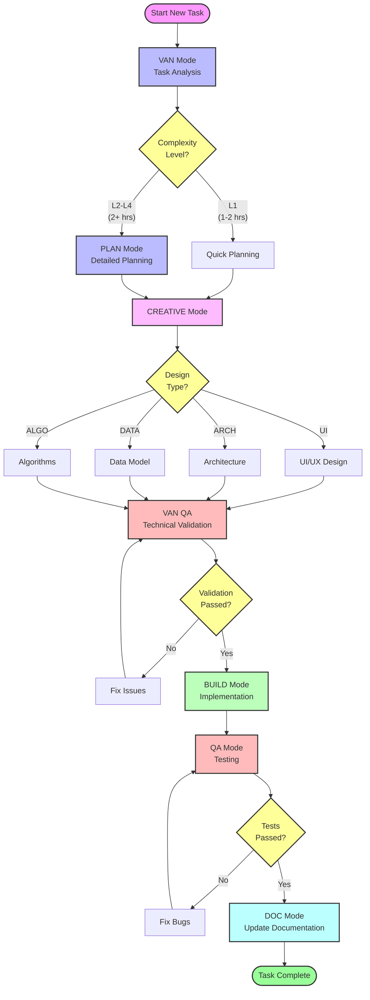

# Memory Bank Workflow Guide

## 🚀 Getting Started

### Initial Project Setup
1. Create project directory
2. Initialize version control
3. Type `VAN` to start the initialization process
   ```
   > VAN
   OK VAN - Beginning Initialization Process
   ```
   This will:
   - Create Memory Bank structure
   - Set up essential documentation
   - Initialize project configuration

### Memory Bank Structure
```
memory-bank/
├── creative/      # Design decisions and creative phase docs
├── reflection/    # Task reflection documents
├── technical/     # Technical documentation
├── testing/       # Test plans and results
├── tasks.md       # Active task tracking
├── progress.md    # Project progress tracking
├── projectbrief.md    # Project overview and goals
├── systemPatterns.md  # Architecture patterns
├── style-guide.md     # Code and design standards
└── techContext.md     # Technical stack info
```

## 🔄 Feature Development Workflow

### High-Level Flow


### Flow Explanation

1. **Start → VAN Mode**
   - Begin with task analysis
   - Determine complexity level

2. **Complexity Decision**
   - L1: Quick planning (1-2 hours)
   - L2-L4: Full PLAN mode (2+ hours)

3. **CREATIVE Mode Options**
   - UI: User interface design
   - ARCH: System architecture
   - DATA: Data modeling
   - ALGO: Algorithm design

4. **VAN QA Validation**
   - Technical requirements
   - Dependencies
   - Build environment
   - Must pass to proceed

5. **BUILD Mode**
   - Implementation
   - Following design decisions
   - Creating tests

6. **QA Testing**
   - Test execution
   - Bug fixes if needed
   - Validation against requirements

7. **Documentation**
   - Update all relevant docs
   - Record implementation details
   - Complete task documentation

## 📋 Available Commands

### 1️⃣ VAN Mode Commands
VAN mode analyzes task complexity and sets up appropriate documentation.

| Command | Description | Estimated Time |
|---------|-------------|----------------|
| `VAN L1` | Quick bug fix/small feature | 1-2 hours |
| `VAN L2` | Simple enhancement | 2-4 hours |
| `VAN L3` | Intermediate feature | 4-8 hours |
| `VAN L4` | Complex system | 8+ hours |

Example:
```bash
> VAN L1
AI: Analyzing for Level 1 task...
YOU: Add a button to clear all completed todos
AI: [Creates task structure for L1]
```

What happens:
- Analyzes task requirements
- Creates task documentation
- Sets up tracking in tasks.md
- Determines next mode based on complexity

### 2️⃣ PLAN Mode Commands
PLAN mode handles task planning and documentation.

| Command | Description |
|---------|-------------|
| `PLAN L1` | Level 1 - Quick Bug Fix planning |
| `PLAN L2` | Level 2 - Enhancement planning |
| `PLAN L3` | Level 3 - Feature planning |
| `PLAN L4` | Level 4 - System planning |

What happens:
- Creates detailed implementation plan
- Breaks down tasks into steps
- Identifies dependencies
- Sets up success criteria
- Creates test plans

### 3️⃣ CREATIVE Mode Commands
CREATIVE mode handles design decisions.

| Command | Purpose |
|---------|---------|
| `CREATIVE UI` | Start UI/UX design phase |
| `CREATIVE ARCH` | Start architecture design phase |
| `CREATIVE DATA` | Start data model design phase |
| `CREATIVE ALGO` | Start algorithm design phase |

What happens:
- Documents design decisions
- Creates mockups/wireframes (UI)
- Defines architecture patterns (ARCH)
- Creates data schemas (DATA)
- Documents algorithms (ALGO)

### 4️⃣ VAN QA Command
```bash
VAN QA
```
Technical validation before implementation.

What happens:
- Validates all technical requirements
- Checks dependencies
- Verifies configurations
- Tests build environment
- Ensures readiness for implementation

### 5️⃣ BUILD Mode
```bash
BUILD
```
Starts implementation phase.

What happens:
- Implements planned features
- Follows design decisions
- Creates/updates tests
- Handles code review preparation

### 6️⃣ QA Mode
```bash
QA
```
Validates implementation.

What happens:
- Runs test suites
- Performs manual testing
- Validates against requirements
- Creates QA report

### 7️⃣ DOC Update
```bash
DOC
```
Updates project documentation.

What happens:
- Updates technical documentation
- Updates user guides
- Updates API documentation
- Records implementation details

## 📝 Example Workflow

### Quick Bug Fix (L1)
```bash
# 1. Start analysis
> VAN L1
AI: Analyzing Level 1 task...
YOU: Fix login button alignment
AI: Creating L1 task structure...

# 2. Quick planning
> PLAN L1
AI: Creating quick fix plan...

# 3. UI design update
> CREATIVE UI
AI: Documenting UI changes...

# 4. Technical validation
> VAN QA
AI: Validating technical requirements...

# 5. Implementation
> BUILD
AI: Starting implementation...

# 6. Testing
> QA
AI: Running tests...

# 7. Documentation
> DOC
AI: Updating documentation...
```

### New Feature (L3)
```bash
# 1. Start analysis
> VAN L3
AI: Analyzing Level 3 task...
YOU: Add user profile page
AI: Creating L3 task structure...

# 2. Detailed planning
> PLAN L3
AI: Creating feature plan...

# 3. Design phases
> CREATIVE UI
AI: Designing user profile UI...
> CREATIVE DATA
AI: Designing profile data model...

# 4. Technical validation
> VAN QA
AI: Validating technical requirements...

# 5. Implementation
> BUILD
AI: Starting implementation...

# 6. Testing
> QA
AI: Running comprehensive tests...

# 7. Documentation
> DOC
AI: Updating system documentation...
```

## 🎯 Best Practices

1. **Always Start with VAN**
   - Let VAN analyze and set up proper structure
   - Follow the recommended mode transitions

2. **Don't Skip Phases**
   - Each phase ensures quality and maintainability
   - Documentation is crucial for future maintenance

3. **Use Appropriate Levels**
   - L1 for quick fixes
   - L2-L4 for progressively complex features

4. **Keep Documentation Updated**
   - Update docs during development
   - Record decisions and changes

5. **Regular QA**
   - Run VAN QA before implementation
   - Perform QA after implementation

## 🚫 Common Pitfalls

1. **Skipping Planning**
   - Always do basic planning, even for L1
   - Prevents scope creep and issues

2. **Bypassing VAN QA**
   - Technical validation prevents issues
   - Required before BUILD mode

3. **Insufficient Documentation**
   - Document decisions and changes
   - Future maintenance depends on good docs

4. **Wrong Level Selection**
   - Be realistic about complexity
   - Better to start higher than too low

## 🆘 Troubleshooting

### Mode Switching Issues
```bash
# If mode switch fails
> VAN
# Start fresh and try again
```

### Documentation Issues
```bash
# Check Memory Bank structure
> VAN
# Will verify and fix structure
```

### Build Blocking
```bash
# If BUILD is blocked
> VAN QA
# Must pass VAN QA first
```

## 📚 Additional Resources

- Memory Bank structure guide
- Task templates
- QA checklists
- Documentation templates

Remember: The Memory Bank system is designed to ensure quality and maintainability. Follow the workflow, and don't skip steps! 